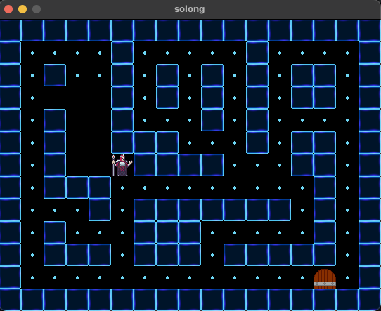

# So Long - 42 Project  

[](./READMEen.md)   [](./README.md)  

### 🌟 Project Objective  

The main goal of **So Long** is to create a **small 2D game** where the player can move through a maze, collect objects, and reach an exit to win. The project uses the **MinilibX** (MLX) graphics library to handle rendering and interactions.  

  
*A preview of the So Long game in action.*  
<br>  

### 🕹️ Features  

Here are the key features that the project must implement:  

1. **Map Reading:**  
   - The game uses a `.ber` file to define the maze.  
   - The map must be properly formatted (rectangular, enclosed by walls, etc.).  

2. **Player Movement:**  
   - The player can move in four directions (up, down, left, right).  
   - Movements are counted and displayed.  

3. **Object Collection:**  
   - The player must collect all objects (usually represented by "C" on the map) before reaching the exit.  

4. **Exit Handling:**  
   - The exit (usually represented by "E") is only accessible after collecting all objects.  

5. **Graphical Display:**  
   - Game elements (player, walls, floor, objects, exit) are represented using textures or simple colors.  

## 🛠️ Technologies Used  

- **Language:** C  
- **Graphics Library:** [MinilibX](https://github.com/42Paris/minilibx-linux)  
- **Compilation:** Makefile  
- **Code Standard:** Strict compliance with 42’s coding norms.  

---

### 🚀 How to Run the Project  

1. Clone this repository:  

   ```bash
   git clone https://github.com/your-username/so_long.git
   cd so_long


2. Compile and Run:
   ```bash
   make
   ./so_long map/nom_de_la_carte.ber
